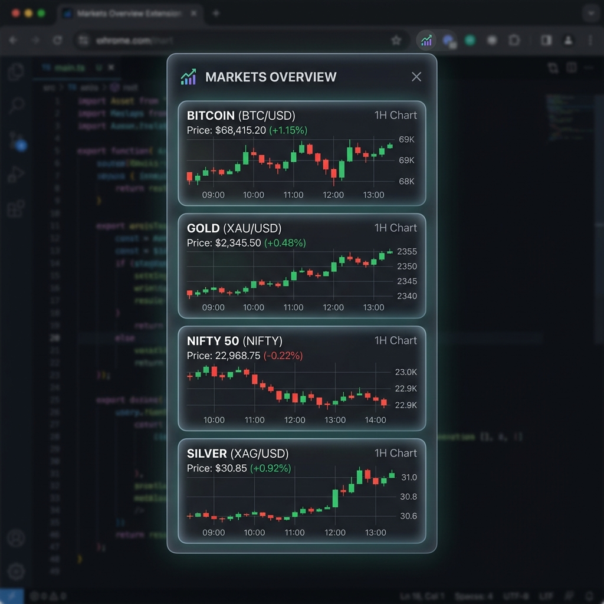

# 📈 Multi-Asset Market Dashboard Extension


*A sleek, high-performance Chrome extension providing real-time tracking and interactive candlestick charting for multiple financial assets in a clean, vertical grid dashboard!*

## ✨ Features

- **Multi-Asset Tracking**: Live data for Bitcoin (BTC), Nifty 50, Gold, and Silver.
- **Interactive Candlestick Charts**: Professional-grade visualization powered by the [Lightweight Charts](https://tradingview.github.io/lightweight-charts/) library.
- **Clean 4x1 Grid Dashboard**: A responsive, visually appealing UI optimized for quick market monitoring.
- **Real-Time Data**: Reliable cross-market data fetching utilizing the Yahoo Finance API.

## 🚀 Workflow & Output

### How It Works
1. **Data Fetching**: The extension securely requests the latest OHLC (Open, High, Low, Close) market data using the Yahoo Finance API.
2. **Data Parsing & Formatting**: The raw JSON data from the API is processed and grouped into historical and live price formats.
3. **Rendering**: The Lightweight Charts engine renders the formatted data into fluid, interactive candlestick charts.
4. **Output Overview**: Upon clicking the extension icon, a sleek pop-up dashboard is displayed. The screen splits into a 4x1 grid showcasing individual charts. You can seamlessly hover over candlesticks to view exact entry, exit, and trend prices without any lag.

## 🛠 Local Installation

To load this extension in Google Chrome:

1. Clone or download this repository.
   ```bash
   git clone https://github.com/kkrunal77/btc-price-extension.git
   ```
2. Open Google Chrome and navigate to `chrome://extensions/`.
3. Enable **Developer mode** using the toggle switch in the top right corner.
4. Click on the **Load unpacked** button.
5. Select the main directory of this repository (where the `manifest.json` is located).
6. Pin the extension to your toolbar. Click the icon to view the live dashboard!

## 💻 Technical Stack

- **Vanilla HTML/CSS/JavaScript**: Core extension structure and styling.
- **[Lightweight Charts](https://tradingview.github.io/lightweight-charts/)**: Renders the high-performance UI charts.
- **Yahoo Finance API**: The data aggregation backbone.
